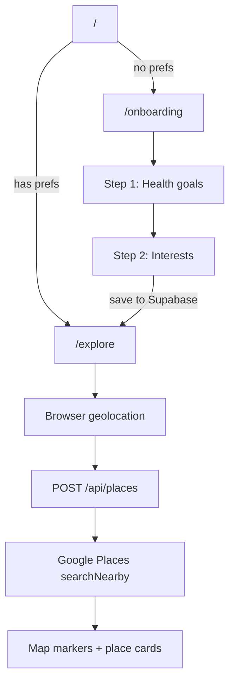

# Interest-Driven Travel Guide, Hackathon Plan (2 Hours)

> **For agents:** This is the source-of-truth plan. Read this before implementing.
> Work is split between **Person A** (onboarding) and **Person B** (maps + recommendations).

## Overview

Build a limited-scope travel guide on the existing **Next.js 16 + React 19 + Tailwind 4** scaffold.

1. **Onboarding journey:** capture health goals (distance radius) and interests (history, food)
2. **Explore page:** use browser geolocation + Google Places to recommend nearby spots on a map

**Starting point:** Only a landing page exists at [`src/app/page.tsx`](src/app/page.tsx). Everything else is greenfield.

---

## User flow



---

## Scope

### In scope (MVP)

- 2-step onboarding wizard (health goals + interests)
- Health goals → search radius mapping
- Interests → Google place types mapping
- Browser geolocation
- Server-side Places API proxy
- Explore page: Google Map + scrollable recommendation list
- Preferences in **Supabase** (`user_preferences` table, anonymous auth)
- "Start over" to clear prefs

### Out of scope (cut if late)

- User accounts / auth
- Manual address search
- Walking directions / route polylines
- Place photos
- More than 2 interest categories
- PWA

---

## Shared contract (do this first, either person, ~5 min)

Create [`src/lib/types.ts`](src/lib/types.ts) before parallel work so both sides agree on shapes:

```ts
export type HealthGoal = "gentle" | "moderate" | "active";
export type Interest = "history" | "food";

export type UserPreferences = {
  healthGoal: HealthGoal;
  interests: Interest[];
};

export type PlaceResult = {
  id: string;
  name: string;
  address: string;
  lat: number;
  lng: number;
  rating?: number;
  googleMapsUri?: string;
};
```

**Preference model:**

| Health goal | Label | Search radius |
|-------------|-------|---------------|
| `gentle` | Gentle stroll | 800 m |
| `moderate` | Moderate walk | 2,000 m |
| `active` | Active explorer | 5,000 m |

| Interest | Google `includedTypes` |
|----------|------------------------|
| `history` | `museum`, `tourist_attraction`, `church` |
| `food` | `restaurant`, `cafe`, `bakery` |

**API contract:** `POST /api/places`:

```ts
// Request body
{ lat: number; lng: number; healthGoal: HealthGoal; interests: Interest[] }

// Response body
{ places: PlaceResult[] }
// or on error: { error: string }
```

**Storage:** Supabase `user_preferences` table, keyed by anonymous `auth.users.id`

```sql
-- see supabase/schema.sql
user_id uuid PK → auth.users
health_goal text  -- gentle | moderate | active
interests text[]  -- history | food
```

**Preferences API** (client-side via `src/lib/preferences.ts`):

```ts
await getPreferences(): Promise<UserPreferences | null>
await savePreferences(prefs: UserPreferences): Promise<void>
await clearPreferences(): Promise<void>
getRadiusMeters(healthGoal): number  // sync helper
```

---

## Person A, Onboarding journey (~1 hour)

**Owns:** Section 1, collecting user preferences and routing into the app.

### Files (Person A only)

| File | Purpose |
|------|---------|
| [`src/lib/types.ts`](src/lib/types.ts) | Shared types (create first if not done) |
| [`src/lib/preferences.ts`](src/lib/preferences.ts) | Async Supabase read/write, `getRadiusMeters` |
| [`src/lib/supabase/client.ts`](src/lib/supabase/client.ts) | Browser Supabase client |
| [`supabase/schema.sql`](supabase/schema.sql) | `user_preferences` table + RLS policies |
| [`src/app/onboarding/page.tsx`](src/app/onboarding/page.tsx) | 2-step client wizard |
| [`src/components/onboarding/HealthStep.tsx`](src/components/onboarding/HealthStep.tsx) | Radio cards for health goals |
| [`src/components/onboarding/InterestsStep.tsx`](src/components/onboarding/InterestsStep.tsx) | Toggle chips for history / food |
| [`src/app/page.tsx`](src/app/page.tsx) | Redirect to `/onboarding` or `/explore` based on stored prefs |
| [`src/app/layout.tsx`](src/app/layout.tsx) | Update title/metadata to "Wander, Interest Travel Guide" |

### Tasks

1. **Shared types:** create `src/lib/types.ts` (if not already done)
2. **Preferences lib:** `src/lib/preferences.ts`:
   - Uses Supabase anonymous auth (auto sign-in on first visit)
   - `getPreferences()` / `savePreferences()` / `clearPreferences()`, async, backed by `user_preferences` table
   - `getRadiusMeters(healthGoal): number`, lookup table from preference model above
3. **Supabase setup:** run `supabase/schema.sql` in SQL Editor; enable Anonymous sign-ins in Auth settings
4. **Onboarding wizard:** `"use client"` multi-step form at `/onboarding`:
   - Step 1: 3 radio-style cards (gentle / moderate / active) with short copy ("~10 min walk", etc.)
   - Step 2: multi-select chips for History and Food (require ≥ 1)
   - Progress indicator ("Step 1 of 2")
   - On finish: `await savePreferences()` → `router.push("/explore")`
   - Match zinc/emerald Tailwind aesthetic from existing scaffold
5. **Home redirect:** update `src/app/page.tsx`:
   - If prefs exist → redirect `/explore`
   - Else → redirect `/onboarding`
6. **Layout metadata:** update `src/app/layout.tsx` title/description

### Person A done when

- [ ] `/onboarding` works end-to-end and saves prefs to Supabase
- [ ] `/` routes correctly based on whether prefs exist
- [ ] `getRadiusMeters()` returns correct values for all 3 health goals

---

## Person B, Maps & recommendations (~1 hour)

**Owns:** Section 2, geolocation, Google Places API, map UI, and recommendation list.

### Files (Person B only)

| File | Purpose |
|------|---------|
| [`src/lib/types.ts`](src/lib/types.ts) | Shared types (read-only if Person A created) |
| [`src/lib/places.ts`](src/lib/places.ts) | Interest → Google types, normalize API response |
| [`src/app/api/places/route.ts`](src/app/api/places/route.ts) | Proxy to Google `places:searchNearby` |
| [`src/app/explore/page.tsx`](src/app/explore/page.tsx) | Geolocation + fetch + layout |
| [`src/components/explore/PlaceMap.tsx`](src/components/explore/PlaceMap.tsx) | Map with user + place markers |
| [`src/components/explore/PlaceList.tsx`](src/components/explore/PlaceList.tsx) | Cards with name, address, "Open in Maps" |
| [`.env.example`](.env.example) | Document required env vars |

### Setup (Person B, first ~10 min)

```bash
npm install @vis.gl/react-google-maps
```

Add to `.env.local` (and `.env.example`):

```
GOOGLE_MAPS_API_KEY=your_server_key
NEXT_PUBLIC_GOOGLE_MAPS_API_KEY=your_browser_key
```

**Google Cloud setup** (if no key yet):

1. Create a project in [Google Cloud Console](https://console.cloud.google.com/)
2. Enable **Places API (New)** and **Maps JavaScript API**
3. Create an API key; restrict browser key to your domain + Maps JS API
4. Billing must be enabled (free tier covers hackathon usage)

### Tasks

1. **Places lib:** `src/lib/places.ts`:
   - `getIncludedTypes(interests: Interest[]): string[]`
   - `normalizePlace(raw): PlaceResult`, map Google response fields to shared type
2. **API route:** `POST /api/places`:
   - Accept `{ lat, lng, healthGoal, interests }`
   - Resolve radius via `getRadiusMeters(healthGoal)` (import from Person A's `preferences.ts`)
   - Call `https://places.googleapis.com/v1/places:searchNearby`
   - Field mask: `places.id,places.displayName,places.formattedAddress,places.location,places.googleMapsUri,places.rating`
   - `maxResultCount: 10`, `rankPreference: DISTANCE`
   - Return `{ places: PlaceResult[] }`
3. **Explore page:** `/explore`:
   - On mount: `await getPreferences()`; redirect to `/onboarding` if missing
   - `navigator.geolocation.getCurrentPosition` for lat/lng
   - Fetch `POST /api/places` with coords + prefs
   - Header: show radius + interests; **"Start over"** calls `clearPreferences()` → `/onboarding`
   - Layout: map on top (or left on desktop), scrollable list below
4. **PlaceMap:** `@vis.gl/react-google-maps`:
   - User marker + numbered place markers
   - (Nice-to-have) clicking marker highlights card
5. **PlaceList:** cards with name, address, rating, link to `googleMapsUri`

### API route sketch

```ts
const response = await fetch(
  "https://places.googleapis.com/v1/places:searchNearby",
  {
    method: "POST",
    headers: {
      "Content-Type": "application/json",
      "X-Goog-Api-Key": process.env.GOOGLE_MAPS_API_KEY!,
      "X-Goog-FieldMask":
        "places.id,places.displayName,places.formattedAddress,places.location,places.googleMapsUri,places.rating",
    },
    body: JSON.stringify({
      includedTypes: resolvedTypes,
      maxResultCount: 10,
      rankPreference: "DISTANCE",
      locationRestriction: {
        circle: { center: { latitude: lat, longitude: lng }, radius },
      },
    }),
  }
);
```

### Person B done when

- [ ] `/api/places` returns normalized places for valid coords + prefs
- [ ] `/explore` shows map with user location and place markers
- [ ] Place list renders with "Open in Google Maps" links
- [ ] "Start over" clears prefs and returns to onboarding
- [ ] Geolocation denial shows friendly error + retry

---

## Integration checklist (both people, last ~10 min)

Run together once both sides are done:

- [ ] Fresh user: `/` → `/onboarding` → complete wizard → `/explore` → sees recommendations
- [ ] Returning user: `/` → `/explore` (skips onboarding)
- [ ] "Start over" on explore → back to onboarding
- [ ] `npm run build` passes with no type errors
- [ ] Env vars set in Vercel dashboard for deploy

---

## Cut lines if running late

Priority order:

1. **Keep:** onboarding + place list with "Open in Google Maps" links (no map OK)
2. **Keep:** geolocation + API route
3. **Drop first:** marker ↔ card click sync
4. **Drop second:** ratings display
5. **Add last:** place photos

---

## Risks

| Risk | Mitigation |
|------|------------|
| Geolocation denied | Friendly error + "Try again" button |
| No Google API key | Person B completes Cloud setup first (~15 min) |
| Few Places results | Widen radius or show "expand search" message |
| CORS / key restrictions on Vercel | Add production URL to API key referrer restrictions |
| Merge conflict on `types.ts` | One person creates it first; other imports only |

---

## Success criteria

A new user can complete onboarding in under 1 minute, land on `/explore`, see their location on a map, and get 5–10 nearby places matching their health radius and interests (history and/or food).
